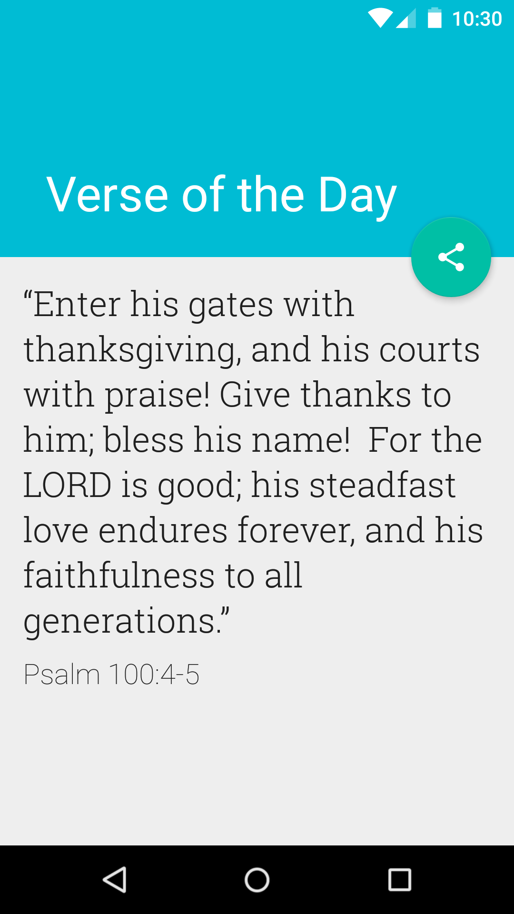
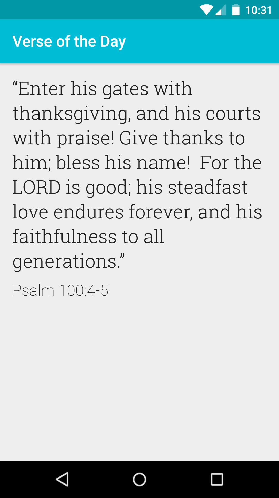
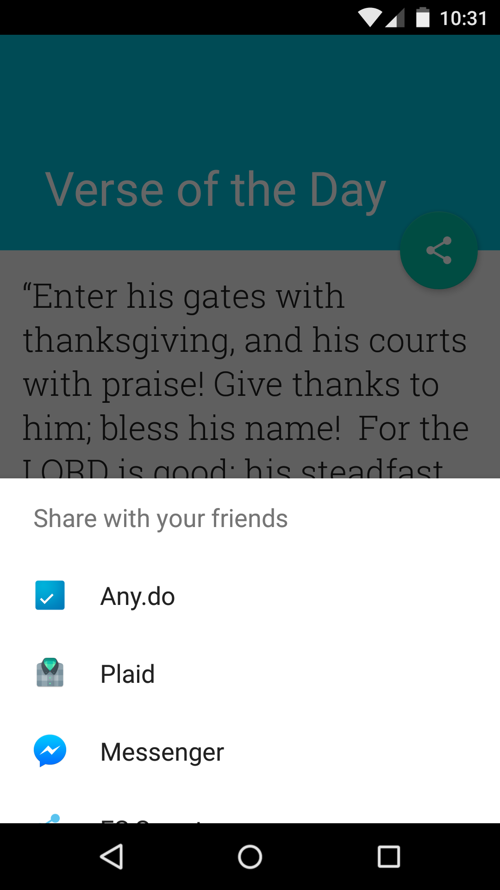

# Verse Of TheDay 

Daily Bible verses Android app

# Screenshots

#Live

[View app live running in the cloud](https://appetize.io/app/zw2jqykaedt0chm8u27629gbn8?device=nexus5&scale=75&orientation=portrait&osVersion=6.0&autoplay=true)

# Download

# Developed By
* Filipe Bezerra - http://filipebezerra.github.io - filipebzerra@gmail.com

# License

   Copyright 2015 Filipe Bezerra

   Licensed under the Apache License, Version 2.0 (the "License");
   you may not use this file except in compliance with the License.
   You may obtain a copy of the License at

       http://www.apache.org/licenses/LICENSE-2.0

   Unless required by applicable law or agreed to in writing, software
   distributed under the License is distributed on an "AS IS" BASIS,
   WITHOUT WARRANTIES OR CONDITIONS OF ANY KIND, either express or implied.
   See the License for the specific language governing permissions and
   limitations under the License.
